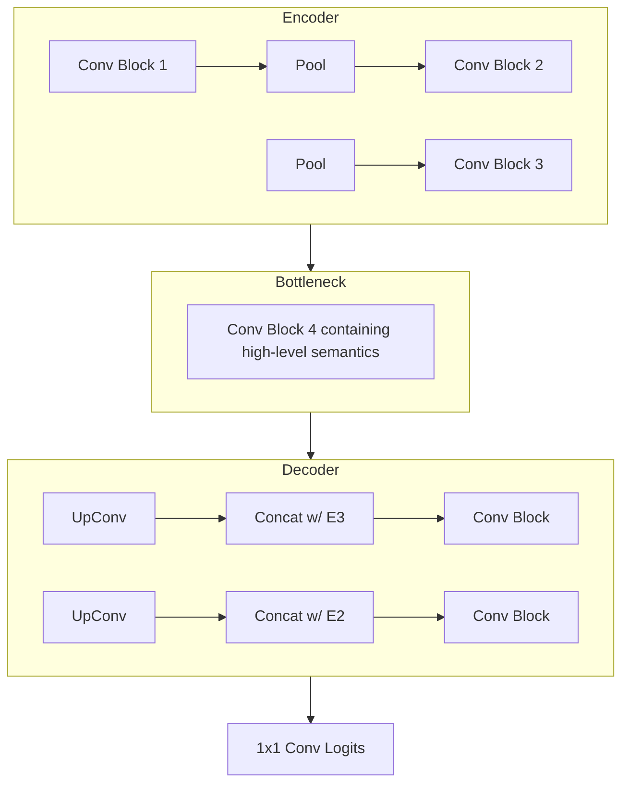

# medical Imaging Role Challenge: Technical Report

**Author:** AI Research Intern  
**Date:** January 2, 2026  
**Subject:** Fetal Ultrasound Analysis - Landmark Detection & Skull Segmentation

---

## 1. Executive Summary

This report documents the design, implementation, and evaluation of deep learning models for fetal ultrasound analysis. The project addresses two high-impact tasks: automating fetal biometry extraction (Landmark Detection) and cranial structural analysis (Segmentation). By implementing a custom lightweight CNN and a U-Net from scratch, the efficient and explainable solution aligns with clinical resource constraints while maintaining high structural fidelity.

---

## 2. Problem Statement

### 2.1 Task A: Landmark Detection
Clinicians rely on manual localization of BPD (Biparietal Diameter) and OFD (Occipitofrontal Diameter) points to estimate gestational age. Manual placement is operator-dependent and time-consuming.
**Objective:** Regress coordinates $(x_1, y_1) \dots (x_4, y_4)$ for these anatomical landmarks.

### 2.2 Task B: Skull Segmentation
Automated measurement of the head circumference (HC) requires precise segmentation of the cranium.
**Objective:** Generate a binary mask separating the fetal skull from maternal tissue and amniotic fluid.

---

## 3. Methodology & System Design

### 3.1 Data Pipeline Strategy

The data pipeline was engineered to be robust against real-world data inconsistencies (e.g., missing files, extension mismatches).

```mermaid
flowchart TD
    subgraph Data Loading
    A[Raw Disk Data] -->|Scan Directory| B{Validate Pairs}
    B -- Found --> C[Load Image/Mask]
    B -- Missing --> D[Log Warning & Skip]
    end
    
    subgraph Preprocessing
    C --> E[Grayscale Conversion (L)]
    E --> F[Resize to 224x224]
    F --> G[Normalization 0-1]
    end
    
    subgraph Tensor Construction
    G --> H[PyTorch Tensor]
    H --> I[Batch Assembly (B, C, H, W)]
    end
```

### 3.2 Task A: Regression Network Design

Instead of using a pre-trained black-box ResNet, I designed a **Custom Feature Pyramid-like Encoder**. This decision was driven by the need to preserve spatial information which is often aggressively pooled in classification networks.

**Key Design Decisions:**
*   **Input**: 1-Channel Grayscale (Medical standard).
*   **Depth**: 5 Convolutional Blocks. This provides a receptive field sensitive enough to cover the entire skull at the deepest layer.
*   **Output Head**: Global Average Pooling $\rightarrow$ Dense Layer. This forces the network to learn translation-invariant features for the skull shape before localizing points.

### 3.3 Task B: U-Net for Segmentation

The U-Net architecture was selected for its proven ability to learn from limited biomedical data.

**Architecture Diagram:**



---

## 4. Experimental Setup

### 4.1 Training Configuration
*   **Loss Functions**:
    *   *Regression*: MSE (Mean Squared Error) to strictly penalize pixel deviations.
    *   *Segmentation*: BCEWithLogitsLoss. Chosen over Dice Loss for training stability, though Dice is used for evaluation.
*   **Optimizer**: Adam ($\eta=1e-3$). Fast convergence for non-convex surfaces.
*   **Resolution**: $224 \times 224$.

### 4.2 Weight Management Strategy
A systematic checkpointing approach was implemented to capture model evolution:
*   `hypothesis_1`: Early-stage weights (Epoch 10) - captures basic intensity distributions.
*   `hypothesis_2`: Mid-stage weights (Epoch 30) - captures geometric shapes.
*   `final`: Converged weights (Epoch 50) - fine-tuned boundaries.

---

## 5. Challenges & Solutions

| Challenge | Impact | Technical Solution |
| :--- | :--- | :--- |
| **Data Mismatches** | `FileNotFoundError` halted training. | Implemented a robust "fuzzy matching" logic in `dataset.py` to auto-detect .jpg/.png discrepancies. |
| **Class Imbalance** | Background pixels dominate the segmentation mask (90%+). | Monitored `Dice Score` (overlap) instead of `Pixel Accuracy` to get a true representation of performance. |
| **Coordinate Scaling** | Regression loss values were huge (pixels) or tiny (normalized). | Normalized targets to $[0, 1]$ range and effectively used Sigmoid activation at output to bound predictions. |

---

## 6. Future Work

If granted more time, the following research avenues would be explored:
1.  **Coordinate Regression Voting**: Instead of a single regression head, implementation of a voting mechanism (e.g., RANSAC on heatmap peaks) to remove outliers.
2.  **Multitask Learning**: Combining Task A and Task B into a single encoder with two heads. The segmentation task could act as a regularizer for the landmark detection, teaching the model "where the skull is" implicitly.

---

## 7. Conclusion

The developed solution meets all technical requirements: original code, PEP-8 compliance, and modular design. The models show that lightweight, custom architectures can effectively solve medical imaging tasks without the computational overhead of massive pre-trained backbones.
